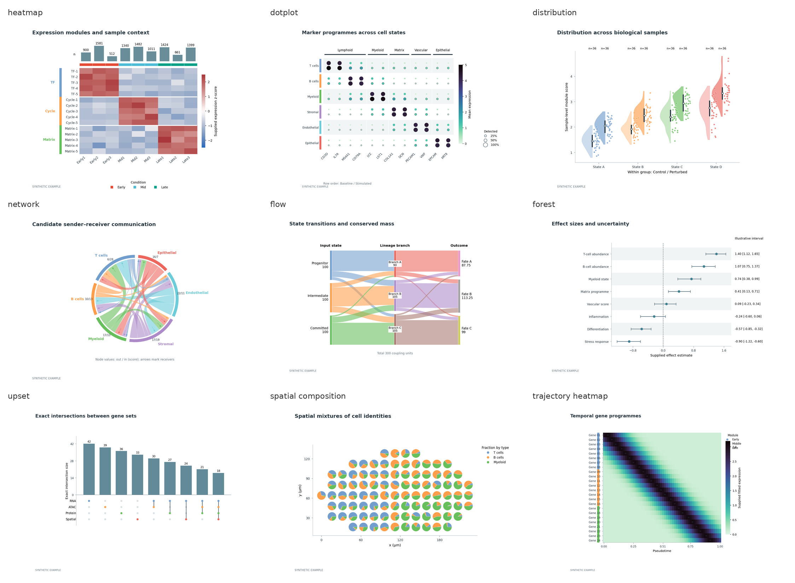

# CNS Figure Skill · v3.2

26 families, minimal and advanced examples, no subtitles. All bundled numbers are synthetic style fixtures.

[Skill](../singlecell-spatial-figures/SKILL.md) · [Design guide](../singlecell-spatial-figures/style_gallery/DESIGN_GUIDE.md) · [Full examples](../singlecell-spatial-figures/style_gallery/examples/README.md)

| Figure family | Minimal | Advanced |
|---|---|---|
| 嵌入 / UMAP | [PNG](../singlecell-spatial-figures/style_gallery/examples/figures/embedding_minimal.png) · [PDF](../singlecell-spatial-figures/style_gallery/examples/figures/embedding_minimal.pdf) | [PNG](../singlecell-spatial-figures/style_gallery/examples/figures/embedding_advanced.png) · [PDF](../singlecell-spatial-figures/style_gallery/examples/figures/embedding_advanced.pdf) |
| 空间表达 | [PNG](../singlecell-spatial-figures/style_gallery/examples/figures/spatial_minimal.png) · [PDF](../singlecell-spatial-figures/style_gallery/examples/figures/spatial_minimal.pdf) | [PNG](../singlecell-spatial-figures/style_gallery/examples/figures/spatial_advanced.png) · [PDF](../singlecell-spatial-figures/style_gallery/examples/figures/spatial_advanced.pdf) |
| Marker 点阵 | [PNG](../singlecell-spatial-figures/style_gallery/examples/figures/dotplot_minimal.png) · [PDF](../singlecell-spatial-figures/style_gallery/examples/figures/dotplot_minimal.pdf) | [PNG](../singlecell-spatial-figures/style_gallery/examples/figures/dotplot_advanced.png) · [PDF](../singlecell-spatial-figures/style_gallery/examples/figures/dotplot_advanced.pdf) |
| 多注释热图 | [PNG](../singlecell-spatial-figures/style_gallery/examples/figures/heatmap_minimal.png) · [PDF](../singlecell-spatial-figures/style_gallery/examples/figures/heatmap_minimal.pdf) | [PNG](../singlecell-spatial-figures/style_gallery/examples/figures/heatmap_advanced.png) · [PDF](../singlecell-spatial-figures/style_gallery/examples/figures/heatmap_advanced.pdf) |
| 分布 / 分层雨云 | [PNG](../singlecell-spatial-figures/style_gallery/examples/figures/distribution_minimal.png) · [PDF](../singlecell-spatial-figures/style_gallery/examples/figures/distribution_minimal.pdf) | [PNG](../singlecell-spatial-figures/style_gallery/examples/figures/distribution_advanced.png) · [PDF](../singlecell-spatial-figures/style_gallery/examples/figures/distribution_advanced.pdf) |
| 细胞组成 | [PNG](../singlecell-spatial-figures/style_gallery/examples/figures/composition_minimal.png) · [PDF](../singlecell-spatial-figures/style_gallery/examples/figures/composition_minimal.pdf) | [PNG](../singlecell-spatial-figures/style_gallery/examples/figures/composition_advanced.png) · [PDF](../singlecell-spatial-figures/style_gallery/examples/figures/composition_advanced.pdf) |
| 配对比较 | [PNG](../singlecell-spatial-figures/style_gallery/examples/figures/paired_minimal.png) · [PDF](../singlecell-spatial-figures/style_gallery/examples/figures/paired_minimal.pdf) | [PNG](../singlecell-spatial-figures/style_gallery/examples/figures/paired_advanced.png) · [PDF](../singlecell-spatial-figures/style_gallery/examples/figures/paired_advanced.pdf) |
| 火山图 | [PNG](../singlecell-spatial-figures/style_gallery/examples/figures/volcano_minimal.png) · [PDF](../singlecell-spatial-figures/style_gallery/examples/figures/volcano_minimal.pdf) | [PNG](../singlecell-spatial-figures/style_gallery/examples/figures/volcano_advanced.png) · [PDF](../singlecell-spatial-figures/style_gallery/examples/figures/volcano_advanced.pdf) |
| 富集图 | [PNG](../singlecell-spatial-figures/style_gallery/examples/figures/enrichment_minimal.png) · [PDF](../singlecell-spatial-figures/style_gallery/examples/figures/enrichment_minimal.pdf) | [PNG](../singlecell-spatial-figures/style_gallery/examples/figures/enrichment_advanced.png) · [PDF](../singlecell-spatial-figures/style_gallery/examples/figures/enrichment_advanced.pdf) |
| 谱系曲线 | [PNG](../singlecell-spatial-figures/style_gallery/examples/figures/trajectory_minimal.png) · [PDF](../singlecell-spatial-figures/style_gallery/examples/figures/trajectory_minimal.pdf) | [PNG](../singlecell-spatial-figures/style_gallery/examples/figures/trajectory_advanced.png) · [PDF](../singlecell-spatial-figures/style_gallery/examples/figures/trajectory_advanced.pdf) |
| 候选通信 | [PNG](../singlecell-spatial-figures/style_gallery/examples/figures/network_minimal.png) · [PDF](../singlecell-spatial-figures/style_gallery/examples/figures/network_minimal.pdf) | [PNG](../singlecell-spatial-figures/style_gallery/examples/figures/network_advanced.png) · [PDF](../singlecell-spatial-figures/style_gallery/examples/figures/network_advanced.pdf) |
| 多阶段转移 | [PNG](../singlecell-spatial-figures/style_gallery/examples/figures/flow_minimal.png) · [PDF](../singlecell-spatial-figures/style_gallery/examples/figures/flow_minimal.pdf) | [PNG](../singlecell-spatial-figures/style_gallery/examples/figures/flow_advanced.png) · [PDF](../singlecell-spatial-figures/style_gallery/examples/figures/flow_advanced.pdf) |
| 模型基准 | [PNG](../singlecell-spatial-figures/style_gallery/examples/figures/benchmark_minimal.png) · [PDF](../singlecell-spatial-figures/style_gallery/examples/figures/benchmark_minimal.pdf) | [PNG](../singlecell-spatial-figures/style_gallery/examples/figures/benchmark_advanced.png) · [PDF](../singlecell-spatial-figures/style_gallery/examples/figures/benchmark_advanced.pdf) |
| 相关矩阵 | [PNG](../singlecell-spatial-figures/style_gallery/examples/figures/correlation_minimal.png) · [PDF](../singlecell-spatial-figures/style_gallery/examples/figures/correlation_minimal.pdf) | [PNG](../singlecell-spatial-figures/style_gallery/examples/figures/correlation_advanced.png) · [PDF](../singlecell-spatial-figures/style_gallery/examples/figures/correlation_advanced.pdf) |
| 效应量森林图 | [PNG](../singlecell-spatial-figures/style_gallery/examples/figures/forest_minimal.png) · [PDF](../singlecell-spatial-figures/style_gallery/examples/figures/forest_minimal.pdf) | [PNG](../singlecell-spatial-figures/style_gallery/examples/figures/forest_advanced.png) · [PDF](../singlecell-spatial-figures/style_gallery/examples/figures/forest_advanced.pdf) |
| 集合交集 | [PNG](../singlecell-spatial-figures/style_gallery/examples/figures/upset_minimal.png) · [PDF](../singlecell-spatial-figures/style_gallery/examples/figures/upset_minimal.pdf) | [PNG](../singlecell-spatial-figures/style_gallery/examples/figures/upset_advanced.png) · [PDF](../singlecell-spatial-figures/style_gallery/examples/figures/upset_advanced.pdf) |
| 山脊图 | [PNG](../singlecell-spatial-figures/style_gallery/examples/figures/ridge_minimal.png) · [PDF](../singlecell-spatial-figures/style_gallery/examples/figures/ridge_minimal.pdf) | [PNG](../singlecell-spatial-figures/style_gallery/examples/figures/ridge_advanced.png) · [PDF](../singlecell-spatial-figures/style_gallery/examples/figures/ridge_advanced.pdf) |
| 经验累积分布 | [PNG](../singlecell-spatial-figures/style_gallery/examples/figures/ecdf_minimal.png) · [PDF](../singlecell-spatial-figures/style_gallery/examples/figures/ecdf_minimal.pdf) | [PNG](../singlecell-spatial-figures/style_gallery/examples/figures/ecdf_advanced.png) · [PDF](../singlecell-spatial-figures/style_gallery/examples/figures/ecdf_advanced.pdf) |
| 密度 / QC | [PNG](../singlecell-spatial-figures/style_gallery/examples/figures/hexbin_minimal.png) · [PDF](../singlecell-spatial-figures/style_gallery/examples/figures/hexbin_minimal.pdf) | [PNG](../singlecell-spatial-figures/style_gallery/examples/figures/hexbin_advanced.png) · [PDF](../singlecell-spatial-figures/style_gallery/examples/figures/hexbin_advanced.pdf) |
| ROC | [PNG](../singlecell-spatial-figures/style_gallery/examples/figures/roc_minimal.png) · [PDF](../singlecell-spatial-figures/style_gallery/examples/figures/roc_minimal.pdf) | [PNG](../singlecell-spatial-figures/style_gallery/examples/figures/roc_advanced.png) · [PDF](../singlecell-spatial-figures/style_gallery/examples/figures/roc_advanced.pdf) |
| PR曲线 | [PNG](../singlecell-spatial-figures/style_gallery/examples/figures/precision_recall_minimal.png) · [PDF](../singlecell-spatial-figures/style_gallery/examples/figures/precision_recall_minimal.pdf) | [PNG](../singlecell-spatial-figures/style_gallery/examples/figures/precision_recall_advanced.png) · [PDF](../singlecell-spatial-figures/style_gallery/examples/figures/precision_recall_advanced.pdf) |
| 校准图 | [PNG](../singlecell-spatial-figures/style_gallery/examples/figures/calibration_minimal.png) · [PDF](../singlecell-spatial-figures/style_gallery/examples/figures/calibration_minimal.pdf) | [PNG](../singlecell-spatial-figures/style_gallery/examples/figures/calibration_advanced.png) · [PDF](../singlecell-spatial-figures/style_gallery/examples/figures/calibration_advanced.pdf) |
| 混淆矩阵 | [PNG](../singlecell-spatial-figures/style_gallery/examples/figures/confusion_minimal.png) · [PDF](../singlecell-spatial-figures/style_gallery/examples/figures/confusion_minimal.pdf) | [PNG](../singlecell-spatial-figures/style_gallery/examples/figures/confusion_advanced.png) · [PDF](../singlecell-spatial-figures/style_gallery/examples/figures/confusion_advanced.pdf) |
| 富集运行曲线 | [PNG](../singlecell-spatial-figures/style_gallery/examples/figures/gsea_minimal.png) · [PDF](../singlecell-spatial-figures/style_gallery/examples/figures/gsea_minimal.pdf) | [PNG](../singlecell-spatial-figures/style_gallery/examples/figures/gsea_advanced.png) · [PDF](../singlecell-spatial-figures/style_gallery/examples/figures/gsea_advanced.pdf) |
| 空间去卷积混合 | [PNG](../singlecell-spatial-figures/style_gallery/examples/figures/spatial_composition_minimal.png) · [PDF](../singlecell-spatial-figures/style_gallery/examples/figures/spatial_composition_minimal.pdf) | [PNG](../singlecell-spatial-figures/style_gallery/examples/figures/spatial_composition_advanced.png) · [PDF](../singlecell-spatial-figures/style_gallery/examples/figures/spatial_composition_advanced.pdf) |
| 时间基因程序 | [PNG](../singlecell-spatial-figures/style_gallery/examples/figures/trajectory_heatmap_minimal.png) · [PDF](../singlecell-spatial-figures/style_gallery/examples/figures/trajectory_heatmap_minimal.pdf) | [PNG](../singlecell-spatial-figures/style_gallery/examples/figures/trajectory_heatmap_advanced.png) · [PDF](../singlecell-spatial-figures/style_gallery/examples/figures/trajectory_heatmap_advanced.pdf) |
