# Minimal → Advanced · v3.1
All values are **synthetic style fixtures**, not biological results.

## 01 · 嵌入 / UMAP
细胞身份如何分布？

| Minimal | Advanced |
|---|---|
| 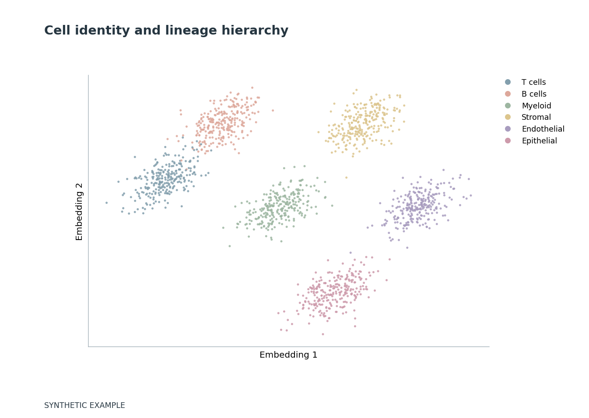 | 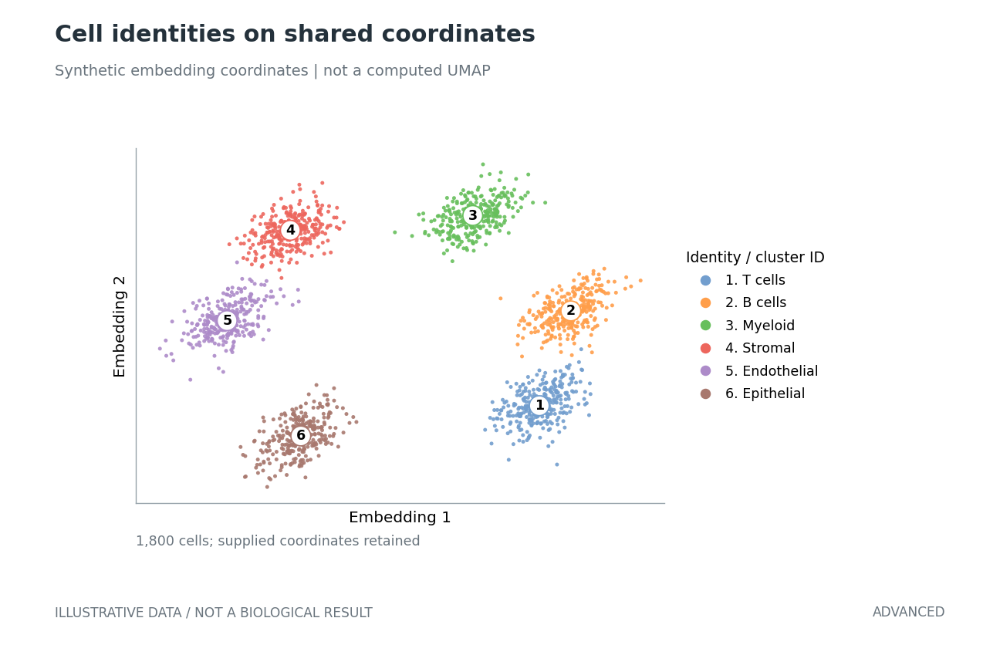 |

**最简版：** 固定坐标散点 + 完整类别图例。

**高级版：** 同一坐标与绘制顺序，加编号式直接标注、完整 ID 色键、显示细胞数。

**论文对照：** [Nature Genetics 2024, Fig. 3a-b,g-h](https://www.nature.com/articles/s41588-024-01664-3) — 原图把空间位置与 UMAP 对应，多个面板保持身份色一致。

**区别与边界：** 本例只使用合成二维坐标，未计算 UMAP；不添加未经估计的轨迹或聚类边界。

**失败条件：** 拥挤或 >18 群时只标目标群；保留完整色键，不能靠旋转/重算嵌入美化。

## 02 · 空间表达
信号位于组织的哪个区域？

| Minimal | Advanced |
|---|---|
| 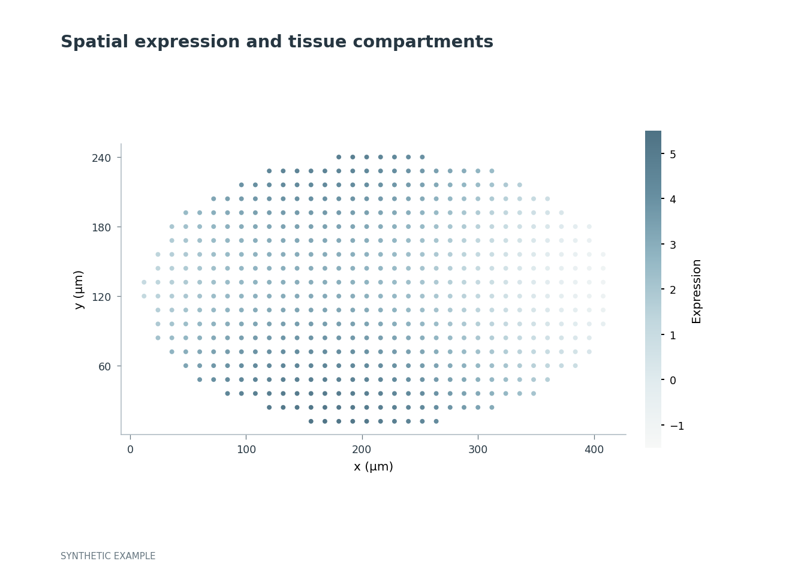 | 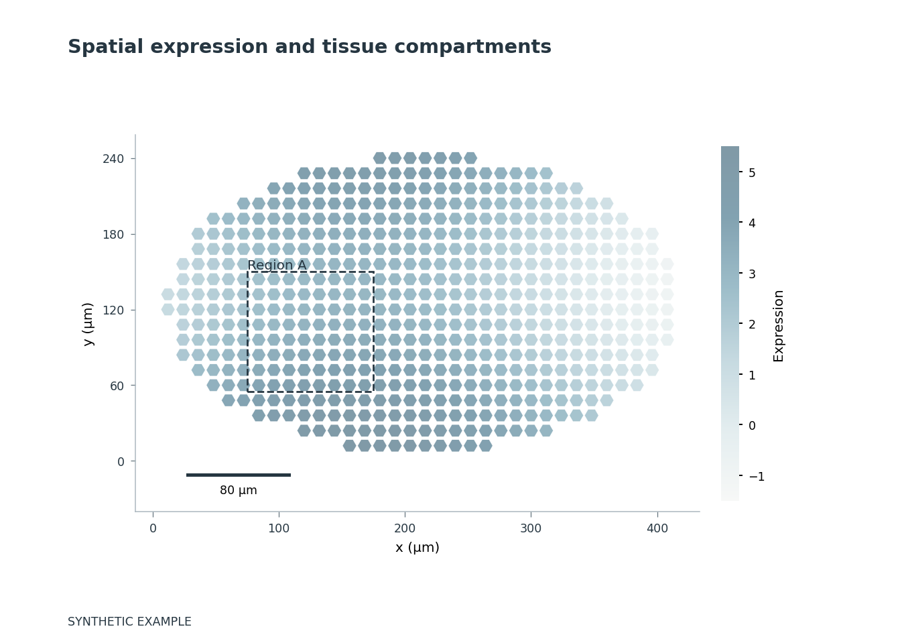 |

**最简版：** 真实比例坐标点 + 单一数值色标 + 单位。

**高级版：** 增加输入区域名称和经校准的比例尺；缺失值单独保留。

**论文对照：** [Nature 2025, Fig. 3](https://www.nature.com/articles/s41586-024-08453-2) — 原图使用空间对应关系及观测/预测值比较，而不是脱离组织背景的散点。

**区别与边界：** 本例没有组织图像或真实配准；区域来自输入列，不能等同病理学注释。

**失败条件：** 先固定物理坐标与范围；无单位校准时禁画微米比例尺。

## 03 · Marker 点阵
哪些群表达哪些 marker，覆盖多少细胞？

| Minimal | Advanced |
|---|---|
| 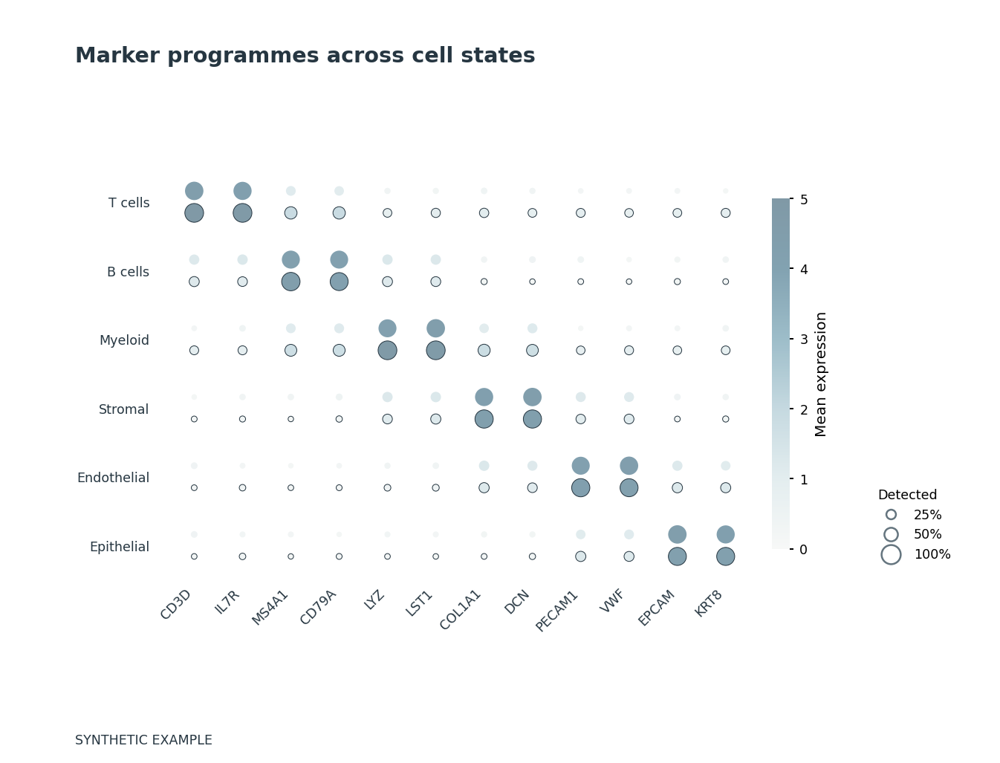 | 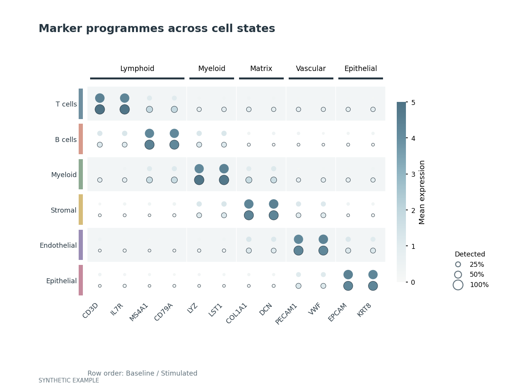 |

**最简版：** 点面积=检测比例，颜色=均值，两种图例均保留。

**高级版：** 相同数据上叠加行间定位条、基因模块分隔，使跨行跨列对应更清楚。

**论文对照：** [Science 2024, Fig. 5C; Fig. 6A](https://pubmed.ncbi.nlm.nih.gov/38781370/) — 论文用点阵把群身份和分子/空间信息放入同一行列系统；不同图中点语义不同。

**区别与边界：** 本例是常规 marker 均值/比例编码，不宣称复现原论文 Fig. 6A 的置信度编码。

**失败条件：** 不得用半径直接等于比例；平均表达所用 assay/layer 与检测阈值必须另声明。

## 04 · 多注释热图
哪些特征形成协同模块？

| Minimal | Advanced |
|---|---|
| 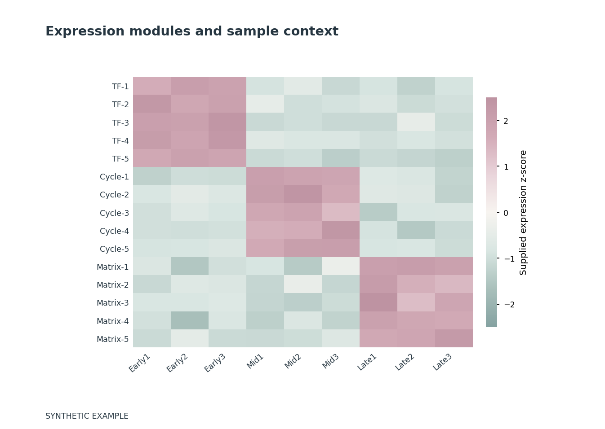 | 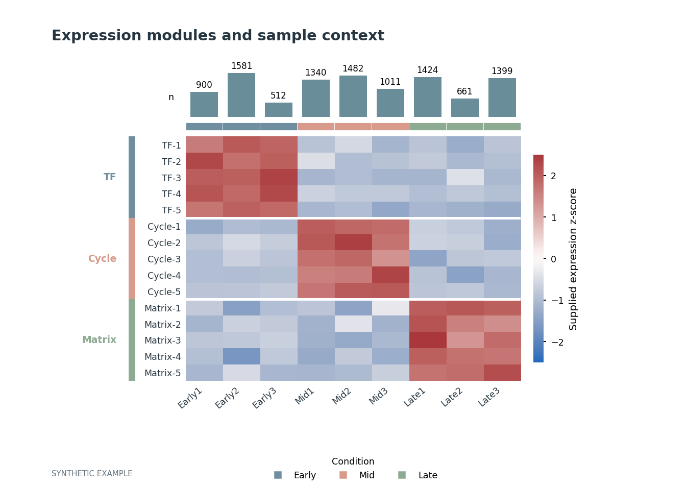 |

**最简版：** 固定行列顺序、中心色标、缺失值显示。

**高级版：** 基因模块带、模块名称、分组分隔及与列索引对齐的细胞数轨道。

**论文对照：** [Science 2024, Fig. 3D; Fig. 6C-D](https://pubmed.ncbi.nlm.nih.gov/38781370/) — 源图/函数将主矩阵与边缘计数、格内效应量对齐；并非独立拼贴。

**区别与边界：** 本例主矩阵是合成 z-score；不把原论文的 -log10(P) 色标与 OR 数字混作表达量。

**失败条件：** 一次排序后所有注释共享索引；没有细胞数列时不能生成边缘计数。

## 05 · 分布 / 雨云
样本分布差异是位移还是离散程度改变？

| Minimal | Advanced |
|---|---|
| 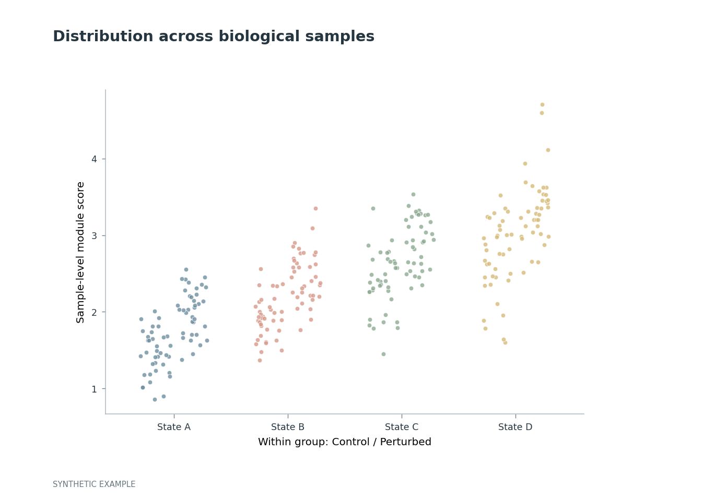 | 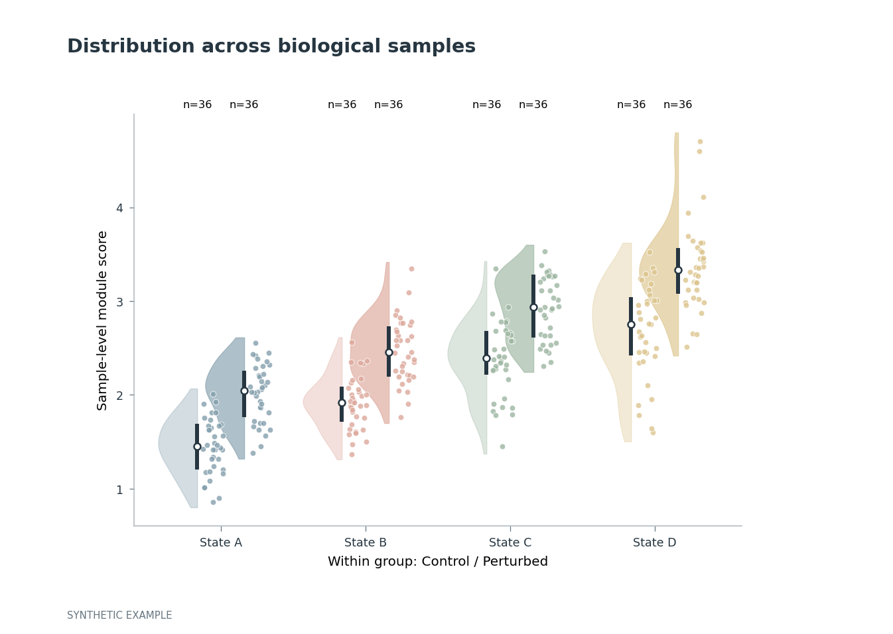 |

**最简版：** 每个样本一个点，不压成均值柱。

**高级版：** 半密度轮廓 + 原始样本点 + 中位数/IQR，明确每组样本数量。

**论文对照：** [Nature Genetics 2024, Fig. 3j](https://www.nature.com/articles/s41588-024-01664-3) — 论文用 violin 显示细胞周期 metagene 在群间的分布，和空间定位联合解释。

**区别与边界：** 本例每个点是合成独立样本，不将论文的细胞层面分布解读为独立生物学重复。

**失败条件：** KDE 只是显示分布，不产生置信区间；极少量观测只显示点和稳健汇总。

## 06 · 组成堆叠
样本间的细胞组成是否一致？

| Minimal | Advanced |
|---|---|
| 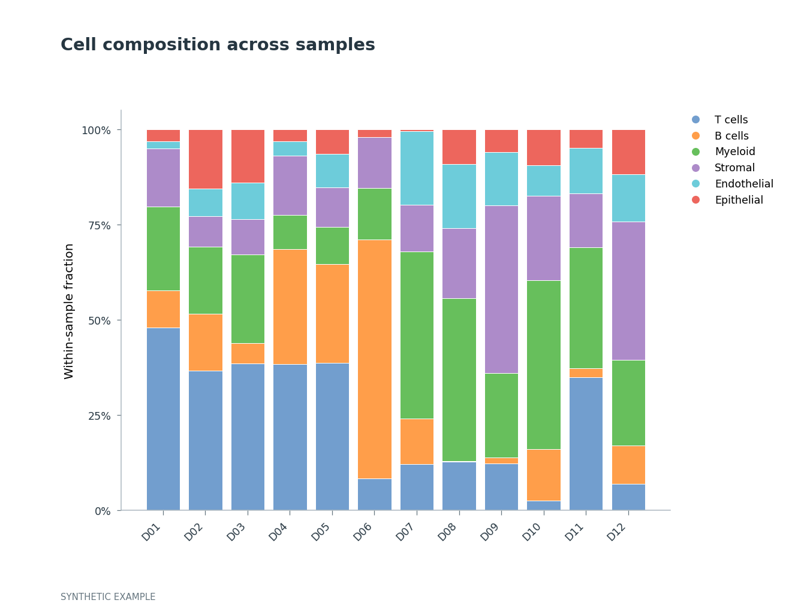 | 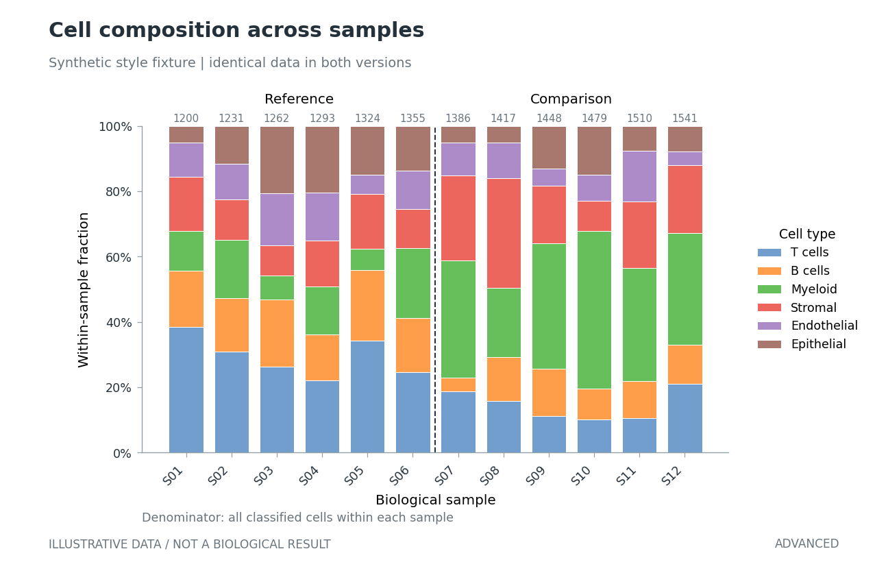 |

**最简版：** 逐样本100%堆叠，明确分母和类别色键。

**高级版：** 条件分区、固定群颜色、每样本 n 标签；不在绘图阶段重归一化。

**论文对照：** [Nature 2024, Fig. 5g-h](https://www.nature.com/articles/s41586-024-08172-8) — 原图逐生物学样本展示组成，并通过侧面注释标明疾病状态与研究来源。

**区别与边界：** 本例用条件分隔替代多条临床注释；未执行组成差异检验。

**失败条件：** 样本不能合并成一个漂亮总体柱；缺失群与真实零区分。

## 07 · 配对比较
同一个样本的前后变化是什么？

| Minimal | Advanced |
|---|---|
| 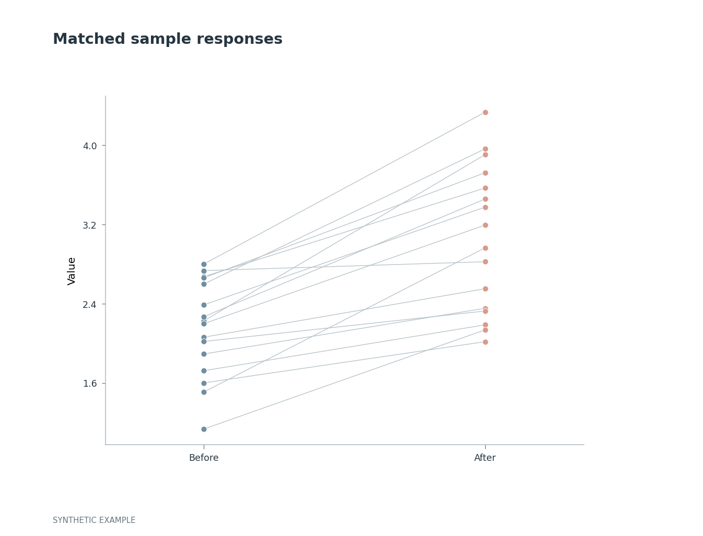 | 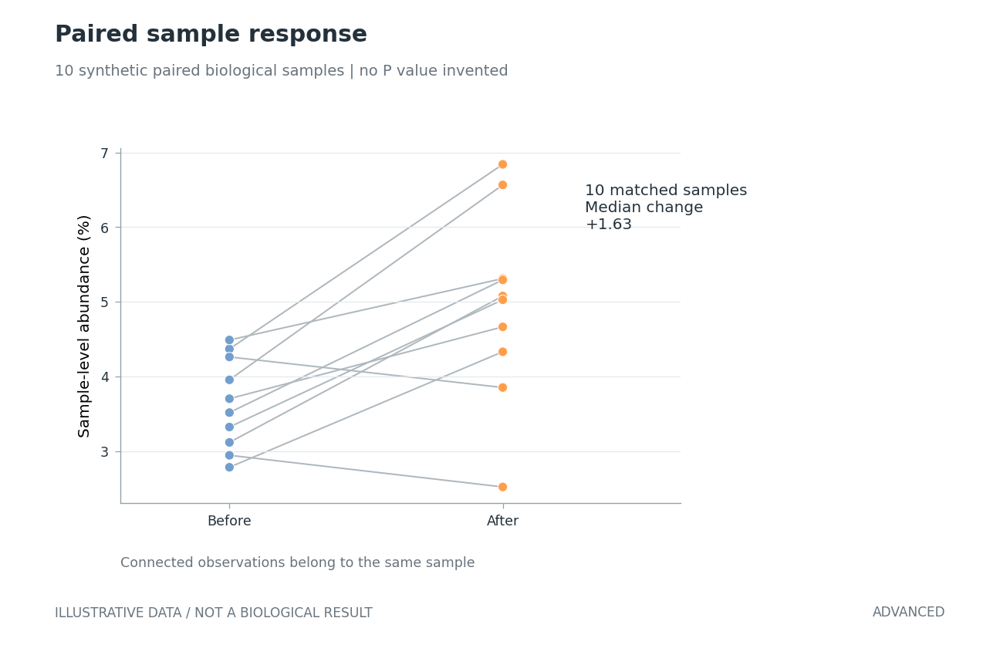 |

**最简版：** 两个条件的全部观测点；仍声明其配对设计。

**高级版：** 保留配对连线、样本数、实际中位变化；不发明显著性。

**论文对照：** [Nature Cell Biology 2024, Extended Data Fig. 3C-F](https://www.nature.com/articles/s41556-024-01469-w) — 作者对匹配半球/重复采用配对分析，检验的单位与图例说明一致。

**区别与边界：** 本例配对线是原创设计迁移；不是宣称原图使用相同版式。

**失败条件：** 只有确实匹配的样本才连线；若配对过多造成拥挤，另画差值分布。

## 08 · 火山图
效应方向、大小和统计证据是否一致？

| Minimal | Advanced |
|---|---|
| 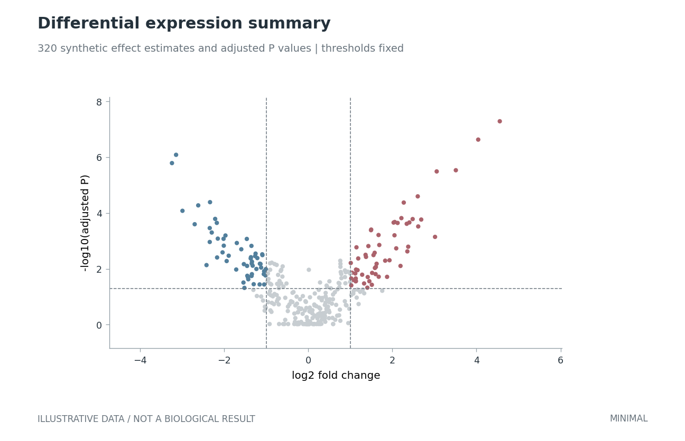 | 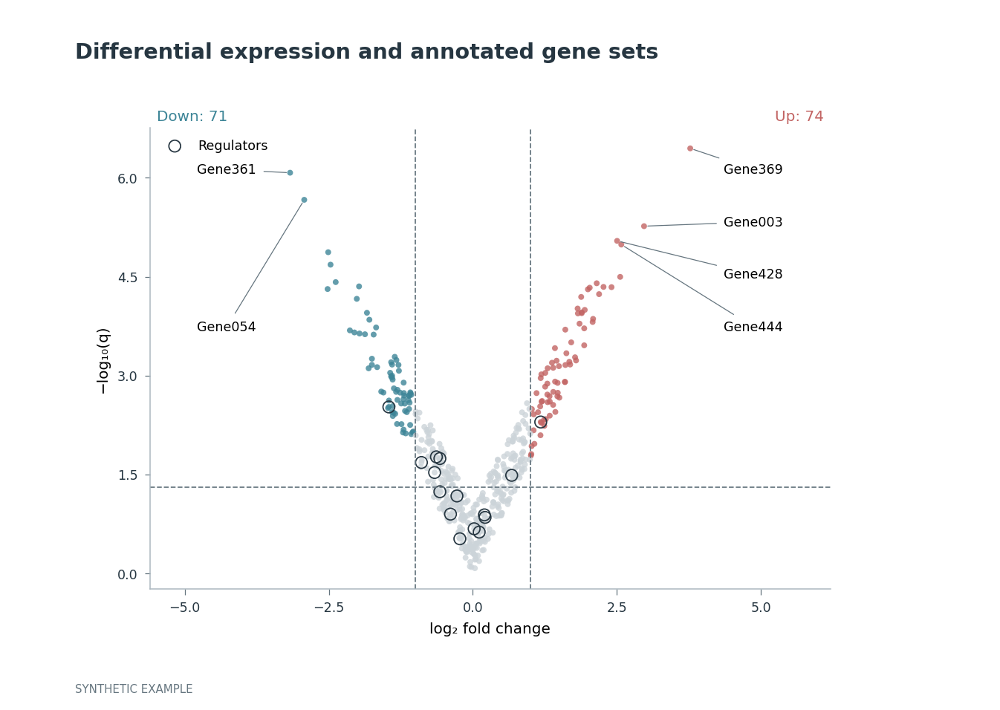 |

**最简版：** 效应-P值点图，保留预先指定的双阈值。

**高级版：** 按固定规则选关键标签、双侧引线及显著条目计数。

**论文对照：** [Nature 2024, Fig. 5m](https://www.nature.com/articles/s41586-024-08172-8) — 原图通过红/蓝区分方向、圈选 SFARI 基因，并加独立基因集富集信息。

**区别与边界：** 本例没有外部 SFARI 注释，因此不画对应圈选或富集柱，避免伪造额外证据。

**失败条件：** 不能为了标签好看选择 cutoff；q=0 必须上游声明绘图下限。

## 09 · 富集棒棒糖
变化方向与统计证据如何同时呈现？

| Minimal | Advanced |
|---|---|
| 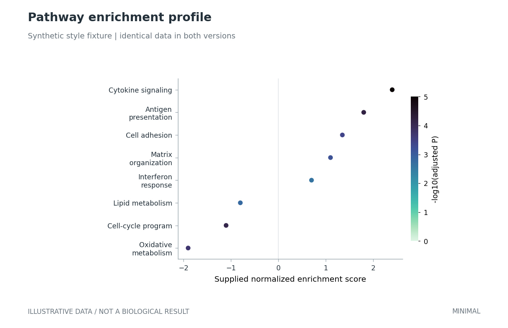 | 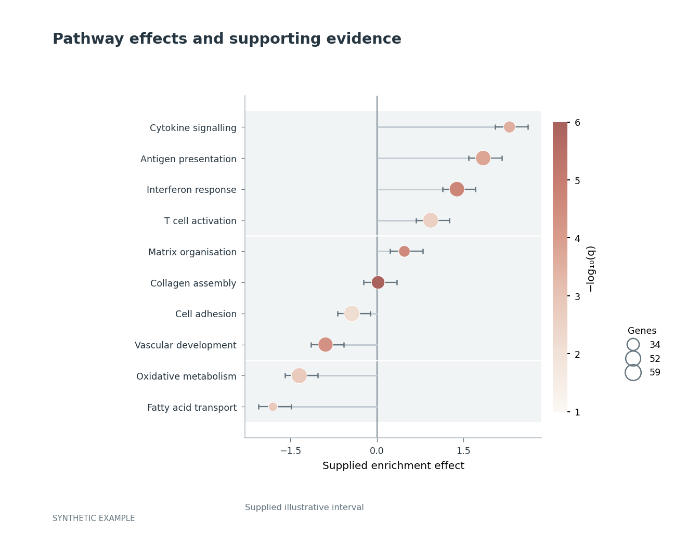 |

**最简版：** 有符号效应横轴 + q 色标 + 可读通路名。

**高级版：** 零点到效应的细线、点面积=基因数、三项清楚分开的编码。

**论文对照：** [Nature Cell Biology 2024, Fig. 5d](https://www.nature.com/articles/s41556-024-01469-w) — 原图利用通路富集解释 NMF 配体-受体因子的功能。

**区别与边界：** 本例使用通用有符号 enrichment score，不重新计算 NMF 或基因集检验。

**失败条件：** NES、OR、GeneRatio不能混为同一横轴；供给哪个量就标哪个量。

## 10 · 时间 / 谱系趋势
不同谱系何时上升、达到峰值或下降？

| Minimal | Advanced |
|---|---|
| 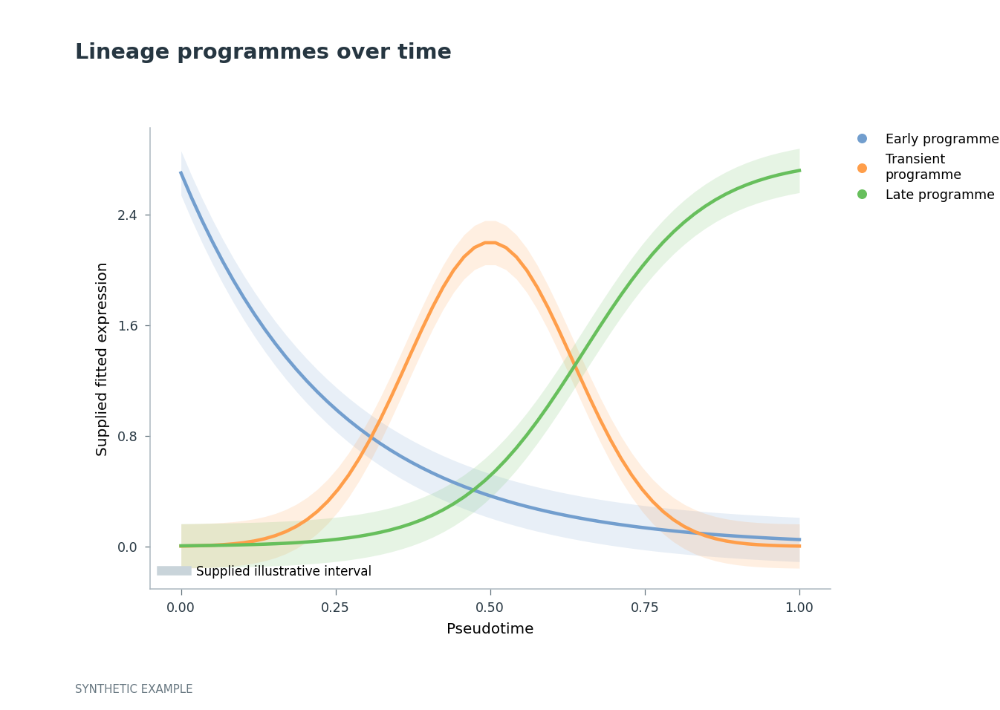 | 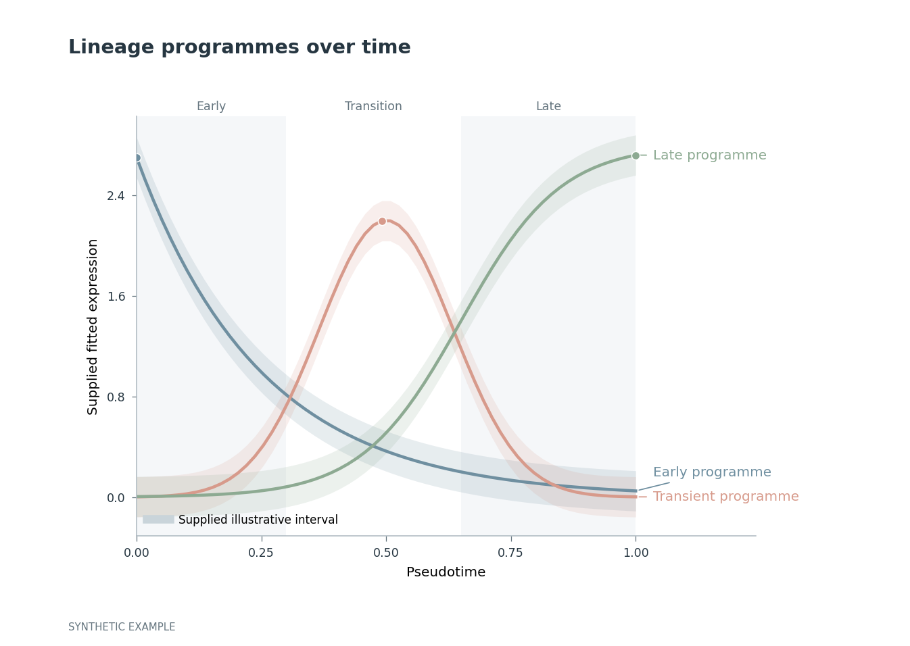 |

**最简版：** 输入的趋势线和区间均保留。

**高级版：** 曲线末端直标、峰值标记、固定谱系颜色，减少重复图例查找。

**论文对照：** [Nature Methods 2024, Fig. 3](https://www.nature.com/articles/s41592-024-02303-9) — 作者在谱系与伪时间下拟合趋势，并在固定时序显示变化，而非重聚类造顺序。

**区别与边界：** 此处渲染输入趋势和区间，不实现 GAM；合成带不称为统计置信区间。

**失败条件：** 区间含义、伪时间定义必须给出；不把相对排序写成真实小时。

## 11 · 发送者-接收者网络
候选通信来自谁、指向谁、强度如何？

| Minimal | Advanced |
|---|---|
| 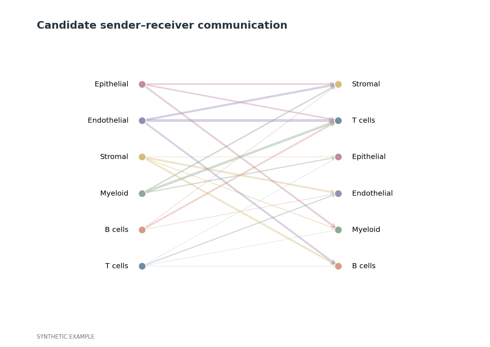 | 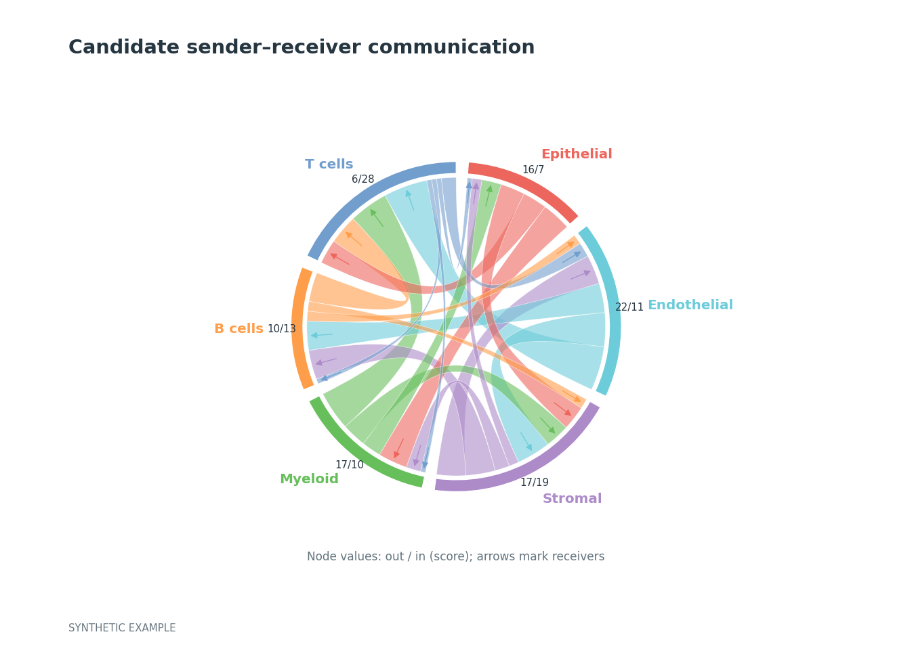 |

**最简版：** 固定两列节点，边宽表示输入的非负得分。

**高级版：** 明确箭头方向、边宽定量图例；身份颜色与嵌入/组成图一致。

**论文对照：** [Science 2024, Fig. 5B](https://pubmed.ncbi.nlm.nih.gov/38781370/) — 原文按发送者/接收者和群身份展示候选细胞通信，而非无语义的装饰连线。

**区别与边界：** 使用双列代替原图圆形排列，以减少交叉；不把推断边写成已验证因果。

**失败条件：** 没有方向证据时禁用箭头；类别密集时优先矩阵或分组网络。

## 12 · 转移 / Alluvial
两个阶段的聚合对应质量如何分配？

| Minimal | Advanced |
|---|---|
| 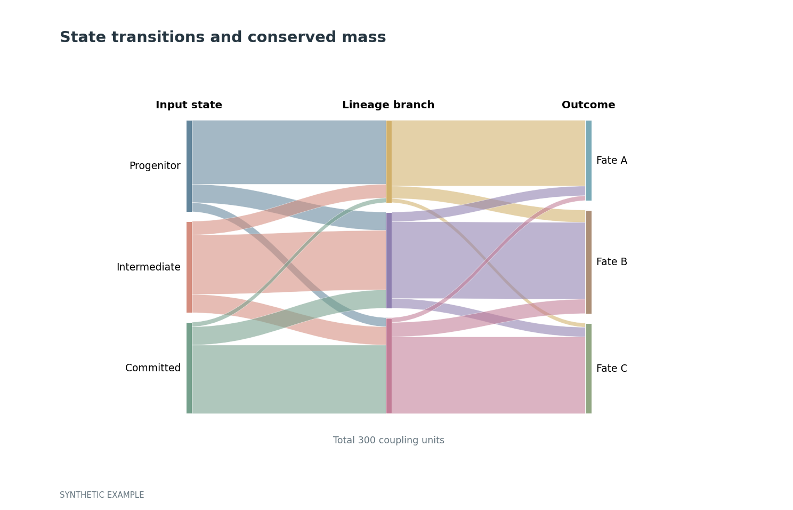 | 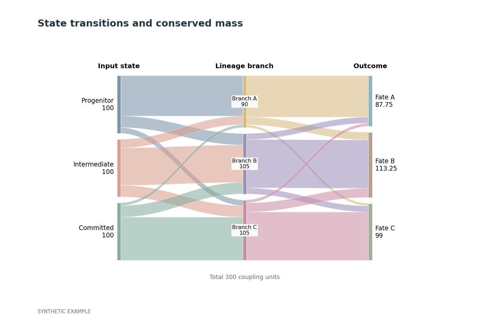 |

**最简版：** 同一质量尺度上的连接带。

**高级版：** 节点总量、完整起止身份、总质量说明，保持每侧宽度一致。

**论文对照：** [Nature 2025, Fig. 5f](https://www.nature.com/articles/s41586-024-08453-2) — 原图以 Sankey 展示不同状态间的转移对应。

**区别与边界：** 示例输入是合成非负 coupling 质量，不拟合 OT，不推断细胞真实迁移路径。

**失败条件：** 不能分别归一化两端后仍称细胞数；缺失边按稀疏表约定是零，缺失数值不是零。

## 13 · 多方法基准比较
同一测试集合上方法差异是否稳定？

| Minimal | Advanced |
|---|---|
| 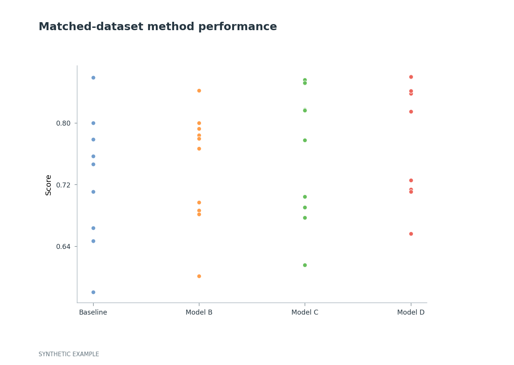 | 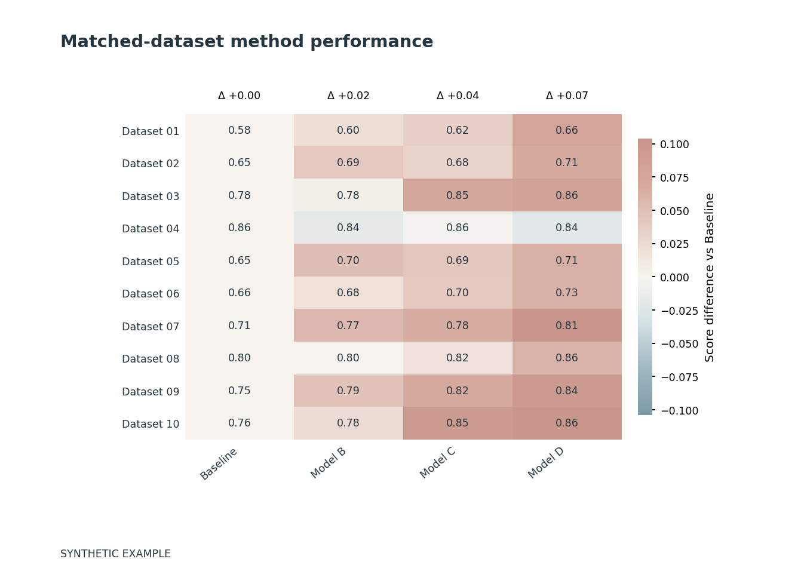 |

**最简版：** 所有数据集的观测点，保留固定方法顺序。

**高级版：** 同一数据集连线 + 每方法中位数短横线，不掩盖失败数据集。

**论文对照：** [Nature Genetics 2024, Fig. 5b](https://www.nature.com/articles/s41588-024-01664-3) — 原文展示12个数据集的分布，明确中位数、IQR和配对检验。

**区别与边界：** 本例是点-线式替代布局，不复制原图箱线，未运行配对检验。

**失败条件：** 方法测试集必须一致；随机种子不得伪装成新的生物学数据集。

## 14 · 相关矩阵
变量间的对应结构是什么？

| Minimal | Advanced |
|---|---|
| 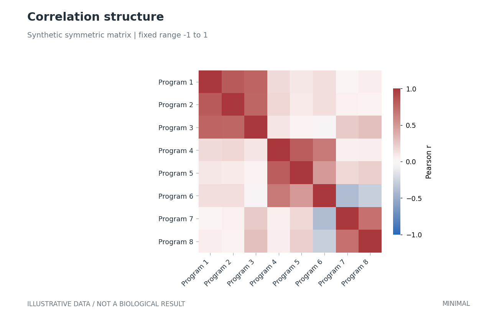 | 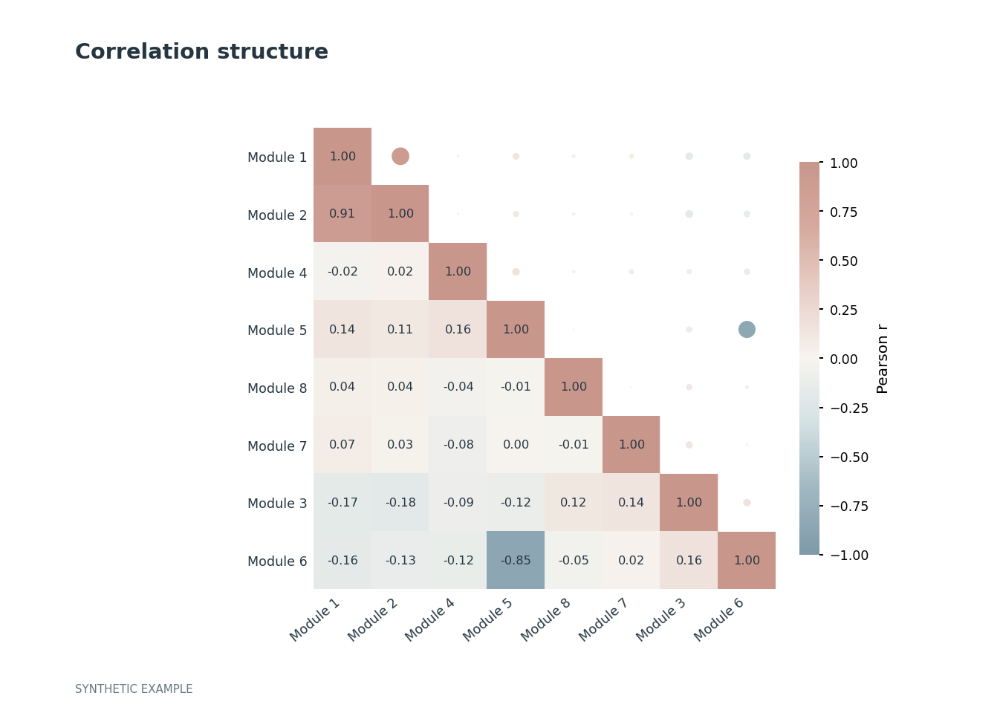 |

**最简版：** 完整矩阵和固定 [-1,1] 发散色标。

**高级版：** 仅在对称矩阵省略重复上三角，格内显示实际 r。

**论文对照：** [Science 2024, Fig. 3B; Fig. 1E](https://pubmed.ncbi.nlm.nih.gov/38781370/) — 原文使用行列注释和明确的相关系数映射进行空间登记。

**区别与边界：** 本例是对称相关矩阵；原文不同体系的矩形矩阵不能套用上三角省略。

**失败条件：** r不是因果或显著性；非对称/不同变量集合必须保留完整矩阵。

## Supplement: 100 synthetic categories
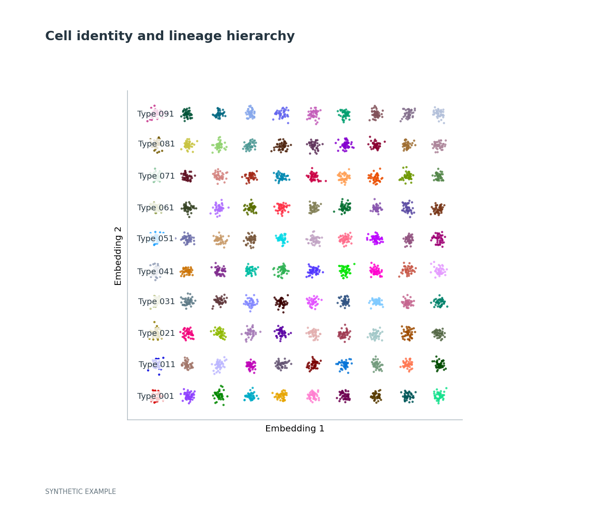
[Complete identity key](figures/embedding_100_advanced.key.pdf) · [Colors CSV](figures/embedding_100_advanced.colors.csv)